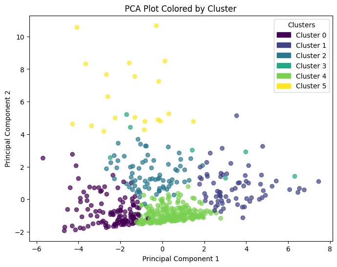
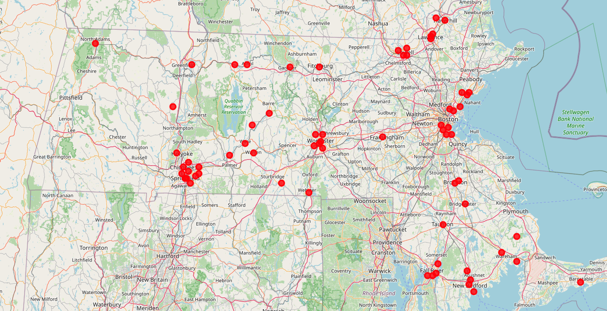

# Midterm Report Video

[https://youtu.be/OXx2D-yzxbk](https://youtu.be/OXx2D-yzxbk)

# Food Deserts

People throughout America experience food insecurity in numerous ways, one of which being food deserts. These are regions in America where people have limited access to nutritious, affordable food. In these regions, fast food and convenience stores are typically the only food sources available, contributing to poor nutrition and long term health issues. 

The goal of this project is to identify those food deserts, and then recommend optimal locations for new food pantries based on the data given.

# Data Collection

The first step of this project is to gather data that will then be run in a clustering algorithm to identify potential food deserts. To accomplish the above goal, we will need socioeconomic information of a given region, and the types of food sources available in that region as well. The socioeconomic data can be collected from [NHGIS](https://www.nhgis.org/) which aggregates US Census Data into reports. The food sources can be collected from [Open Street Maps](https://wiki.openstreetmap.org/wiki/Downloading_data). This has been completed using data from Massachusetts and will be discussed further below.

## OSM Data Collection `notebooks/01_osm_processing.ipynb`

This notebook takes in an Open Street Maps `osm.pbf` file and extracts all relevant food related places in a given state. The `osm.pbf` file had to be left out of the repo due to size, but it can be found at [Geofabrik](https://download.geofabrik.de/north-america/us.html). Each point of interest then gets joined together into a dataframe, in which we can see the name and type of establishment, along with its coordinates. We want to identify specific zip codes in need, so we then convert the coordinates into zip codes using [shape files](https://www.census.gov/programs-surveys/geography/guidance/geo-areas/zctas.html) (also had to be left out due to size). This is published by the US Census Bureau and it outlines geometric boundaries for each zip code, which in turn allows us to map our coordinates to their respective zip code. Once that is done, the data is then saved to `data/osm/massachusetts_osm.csv`.

## Census Data Collection `notebooks/02_census_processing.ipynb`

Processing the census data took a bit more time as there were multiple data sources that had to be aggregated together. The goal was to gather data on poverty rate, median household income, educational attainment, SNAP usage, and per capita income. These would give us a good understanding of the socioeconomic position of the zip code being analyzed. Within the notebook, each cell represents the processing of one of those aforementioned components into a large data frame. It essentially involved extracting specific columns from a csv, renaming it, and then joining based on zip code. Once all the data was aggregated, it needed to be cleaned as the data quality was lacking in some areas. To solve this,any rows that were missing more than 50% of the fields were dropped, and for each remaining row, missing data was filled in with the median value of that specific column. The cleaned data is then saved to `data/census/massachusetts_census.csv`.

## Combining OSM and Census Data `notebooks/03_combine_census_osm.ipynb`

Now that we had OSM and Census data, it needed to be joined together. Each point of interest type in the OSM data was combined together by zip code, summed, and joined to the census data. This allows us to view socioeconomic information, and the amount of food related places, in each zip code. This data is then saved to `data/processed/massachusetts_food_access.csv`.

# Data Processing

With the OSM and Census data combined together, data processing could start. The goal is to use KMeans on the data to identify zip codes with similar food options available and socioeconomic standing. From there further analysis can be used to determine in need areas that may benefit from food additional food pantries in the area.

## Clustering Algorithm and Analysis `notebooks/04_clustering.ipynb`

The specific features we care about are extracted from our dataset, and is then used in the elbow method to determine an optimal value for `n` which happened to be `n=6`. KMeans is then run, and we use PCA on it to visualize it in a 2D space. 

As can be seen, there are some clear clusterings that are formed. Digging further to understand the data better, we can calculate the mean of each feature by cluster. Here is that ouput.

| Cluster | Poverty Rate | Median Income Household | Percent Lower Education | Percent Higher Education | Percent SNAP Participation | Per Capita Income | Num Food Access | Num Grocery | Num Food Pantries | Num Fast Food | Num Restaurants |
|---------|-------------|-------------------------|-------------------------|--------------------------|----------------------------|------------------|----------------|------------|------------------|--------------|----------------|
| 0       | 0.049662    | 168454.43               | 0.131273                | 0.868727                 | 0.054821                   | 88488.48        | 9.61           | 0.42       | 0.07              | 1.82         | 5.38           |
| 1       | 0.217604    | 64458.79                | 0.518521                | 0.481479                 | 0.316685                   | 32389.62        | 10.43          | 0.82       | 0.06              | 3.15         | 5.25           |
| 2       | 0.075665    | 110960.49               | 0.268055                | 0.731945                 | 0.108160                   | 60060.65        | 26.49          | 2.06       | 0.21              | 6.08         | 14.54          |
| 3       | 0.225573    | 97097.64                | 0.373180                | 0.626820                 | 0.193878                   | 52585.43        | 32.43          | 0.57       | 6.43              | 5.14         | 15.43          |
| 4       | 0.071986    | 101896.34               | 0.321283                | 0.678717                 | 0.101495                   | 51182.14        | 2.93           | 0.19       | 0.04              | 0.80         | 1.32           |
| 5       | 0.161314    | 100816.05               | 0.207789                | 0.792211                 | 0.131777                   | 67776.15        | 84.90          | 2.80       | 0.55              | 18.55        | 47.25          |

Cluster 1 and 3 both stand out to due their high poverty rate, but cluster 1 appears to be not as well off due to its lower median income household, higher SNAP participation, and lower food access. These points in the cluster can then be taken and mapped in Massachusetts.

Each red dot represents a zip code that was found within cluster 1. The map is interactive and can be better seen in the video. Spot checking some of these locations, it appears that the clustering algorithm has identified comparatively less well off areas that could benefit from food pantries.

# Future Work

In terms of next steps, I would like to clean up my code and modularize it so that I can gather data on more states and present data on a regional level. After that, I will need to work on the optimization algorithm to determine which a food pantry may be best suited given a range of inputs. I also would like to include another data source or two to help in that determination, such as NTD transportation data to determine accessibility of a given area.

# Citations

Steven Manson, Jonathan Schroeder, David Van Riper, Katherine Knowles, Tracy Kugler, Finn Roberts, and Steven Ruggles. IPUMS National Historical Geographic Information System: Version 19.0 [dataset]. Minneapolis, MN: IPUMS. 2024. http://doi.org/10.18128/D050.V19.0
