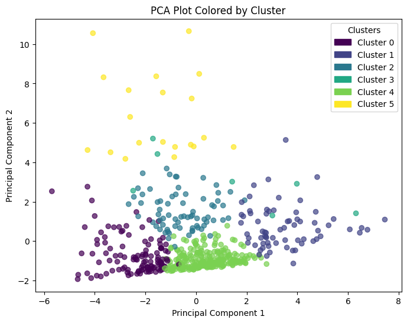
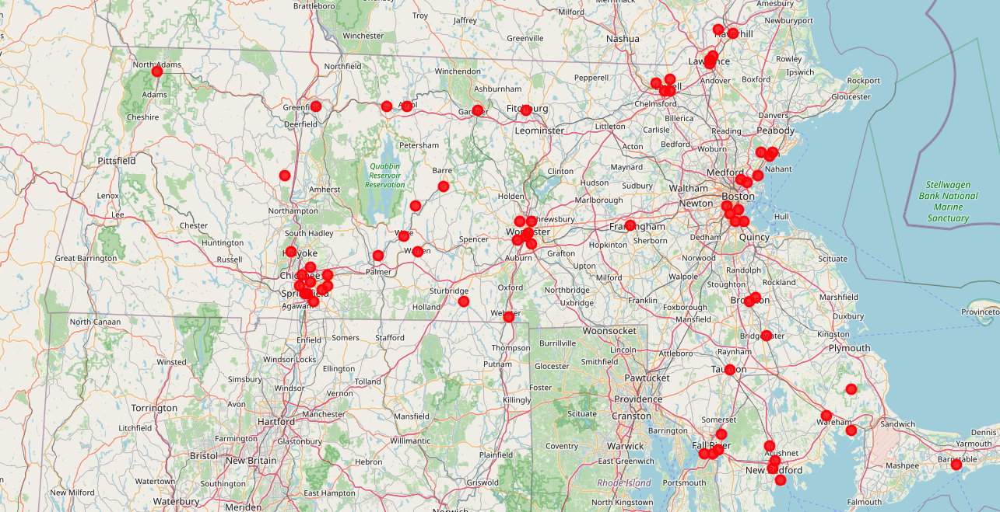
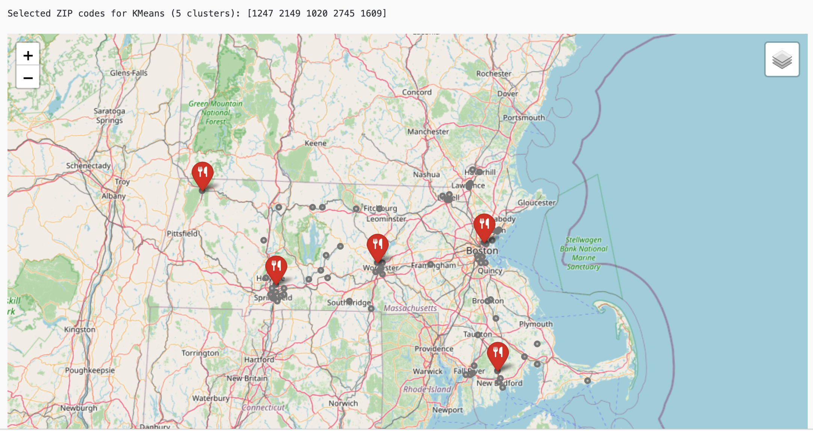
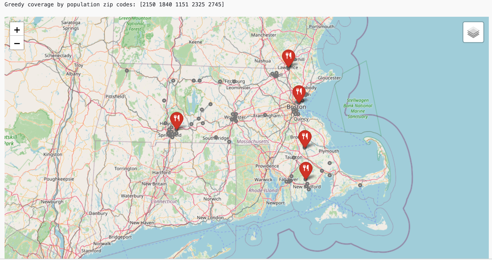
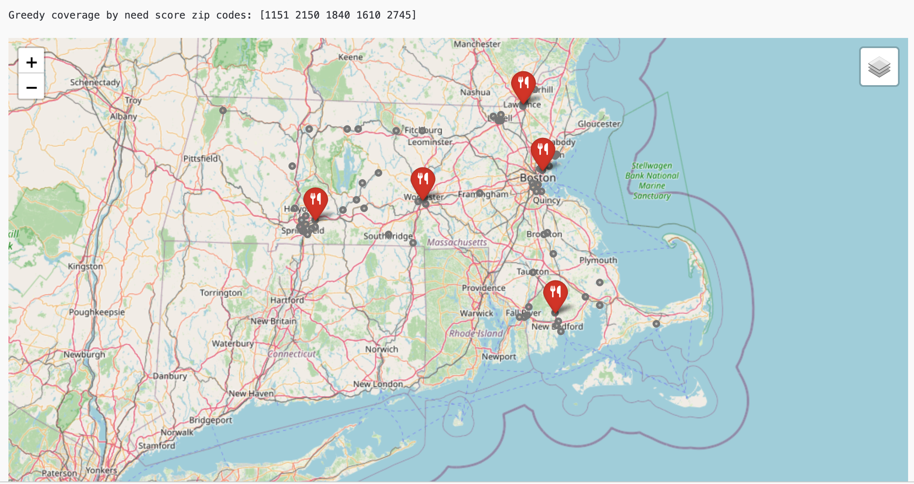

# Final Report Video

[https://youtu.be/pI4A2NvCFCg](https://youtu.be/pI4A2NvCFCg)

# Food Deserts

People throughout America experience food insecurity in numerous ways, one of which being food deserts. These are regions in America where people have limited access to nutritious, affordable food. In these regions, fast food and convenience stores are typically the only food sources available, contributing to poor nutrition and long term health issues. 

The goal of this project is to identify those food deserts, and then recommend optimal locations for new food pantries based on the data given.

# Reproducibility

All work done for this project has been done in Jupyter notebooks found in the `notebooks/` directory. To reproduce any of the results the steps are as follows.

1. Setup local virtual environment.
2. `pip install -r requirements.txt`
3. Go through and run the notebooks in sequential order (01, 02, ...).

    _Note:_ A good chunk of the work done in notebooks 01, 02, and 03 involved data processing from Open Street Maps and US Census Data. I have included almost all of the data files, besides the `tl_2020_us_zcta520.shp` ([found here](https://www.census.gov/geographies/mapping-files/time-series/geo/tiger-line-file.html)) and `massachusetts.osm.pbf` ([found here](https://download.geofabrik.de/north-america/us/massachusetts.html)) files used in `01_osm_processing.ipynb` as they are both around 1 GB each. However, the resulting processed CSVs are saved in the repo so notebooks 04 and 05 can run.
4. Tune parameters in `05_optimize_locations.ipynb`, such as `n_pantries` `radius` `need_scores`, to generate different optimized locations for food pantries.

# Testing

I included a Github Workflow in `.github/workflows/tests.yml` which runs all tests found in `testing/test_optimize.py`. It tests  utility functions used in my optimization notebook, such as distance matrix computation, KMeans based optimization, and greedy selection logic for reproducibility and correctness.

# Data Collection

The first step of this project is to gather data that will then be run in a clustering algorithm to identify potential food deserts. To accomplish the above goal, we will need socioeconomic information of a given region, and the types of food sources available in that region as well. The socioeconomic data can be collected from [NHGIS](https://www.nhgis.org/) which aggregates US Census Data into reports. The food sources can be collected from [Open Street Maps](https://wiki.openstreetmap.org/wiki/Downloading_data). This has been completed using data from Massachusetts and will be discussed further below.

## OSM Data Collection `notebooks/01_osm_processing.ipynb`

This notebook takes in an Open Street Maps `osm.pbf` file and extracts all relevant food related places in a given state. The `osm.pbf` file had to be left out of the repo due to size, but it can be found at [Geofabrik](https://download.geofabrik.de/north-america/us.html). Each point of interest then gets joined together into a dataframe, in which we can see the name and type of establishment, along with its coordinates. We want to identify specific zip codes in need, so we then convert the coordinates into zip codes using [shape files](https://www.census.gov/programs-surveys/geography/guidance/geo-areas/zctas.html) (also had to be left out due to size). This is published by the US Census Bureau and it outlines geometric boundaries for each zip code, which in turn allows us to map our coordinates to their respective zip code. Once that is done, the data is then saved to `data/osm/massachusetts_osm.csv`.

## Census Data Collection `notebooks/02_census_processing.ipynb`

Processing the census data took a bit more time as there were multiple data sources that had to be aggregated together. The goal was to gather data on poverty rate, median household income, educational attainment, SNAP usage, and per capita income. These would give us a good understanding of the socioeconomic position of the zip code being analyzed. Within the notebook, each cell represents the processing of one of those aforementioned components into a large data frame. It essentially involved extracting specific columns from a csv, renaming it, and then joining based on zip code. Once all the data was aggregated, it needed to be cleaned as the data quality was lacking in some areas. To solve this,any rows that were missing more than 50% of the fields were dropped, and for each remaining row, missing data was filled in with the median value of that specific column. The cleaned data is then saved to `data/census/massachusetts_census.csv`.

## Combining OSM and Census Data `notebooks/03_combine_census_osm.ipynb`

Now that we had OSM and Census data, it needed to be joined together. Each point of interest type in the OSM data was combined together by zip code, summed, and joined to the census data. This allows us to view socioeconomic information, and the amount of food related places, in each zip code. This data is then saved to `data/processed/massachusetts_food_access.csv`.

# Data Processing

Now that we have aggregated Open Street Maps and US Census data together, data processing can now start. This is where we can start to understand what regions of Massachusetts are underprivileged and are in need of food pantries.

## Identify High Risk Regions `notebooks/04_clustering.ipynb`

The goal is to use KMeans on the data to identify zip codes with similar food options available and socioeconomic standing. When KMeans is ran, we use PCA to get a 2D view of the clustering that occurs.



As can be seen, there are some clear clusterings that are formed. Digging further to understand the data better, we can calculate the mean of each feature by cluster. Here is that ouput.

| Cluster | Poverty Rate | Median Income Household | Percent Lower Education | Percent Higher Education | Percent SNAP Participation | Per Capita Income | Num Food Access | Num Grocery | Num Food Pantries | Num Fast Food | Num Restaurants |
|---------|-------------|-------------------------|-------------------------|--------------------------|----------------------------|------------------|----------------|------------|------------------|--------------|----------------|
| 0       | 0.049662    | 168454.43               | 0.131273                | 0.868727                 | 0.054821                   | 88488.48        | 9.61           | 0.42       | 0.07              | 1.82         | 5.38           |
| 1       | 0.217604    | 64458.79                | 0.518521                | 0.481479                 | 0.316685                   | 32389.62        | 10.43          | 0.82       | 0.06              | 3.15         | 5.25           |
| 2       | 0.075665    | 110960.49               | 0.268055                | 0.731945                 | 0.108160                   | 60060.65        | 26.49          | 2.06       | 0.21              | 6.08         | 14.54          |
| 3       | 0.225573    | 97097.64                | 0.373180                | 0.626820                 | 0.193878                   | 52585.43        | 32.43          | 0.57       | 6.43              | 5.14         | 15.43          |
| 4       | 0.071986    | 101896.34               | 0.321283                | 0.678717                 | 0.101495                   | 51182.14        | 2.93           | 0.19       | 0.04              | 0.80         | 1.32           |
| 5       | 0.161314    | 100816.05               | 0.207789                | 0.792211                 | 0.131777                   | 67776.15        | 84.90          | 2.80       | 0.55              | 18.55        | 47.25          |

Cluster 1 and 3 both stand out to due their high poverty rate, but cluster 1 appears to be not as well off due to its lower median income household, higher SNAP participation, and lower food access. These points in the cluster can then be taken and mapped in Massachusetts.



Each red dot represents a zip code that was found within cluster 1. The map is interactive and can be better seen in the video. Spot checking some of these locations, it appears that the clustering algorithm has identified comparatively less well off areas that could benefit from food pantries.

## Optimize Food Pantry Locations `notebooks/05_optimize_locations.ipynb`

Now that we have our cluster of interest, we can try to optimally place food pantries among that subset of zip codes. There were two approaches that I decided to take when trying to tackle this optimization problem. 

### KMeans Minize Average Distance

First of all, I thought it would be great to minimize the average distance distance for as many zipcodes as possible. To accomplish this, I utilized KMeans again on cluster 1, where k = number of food pantries, and then returned the centroids of each cluster. This generated the following map...



### Greedy Maximize Coverage

The next approach I wanted to take was a greedy one in which we maximized the coverage of a food pantry in a given radius, based on some factor. The first factor I tried to maximize was population, which generated the following map...



After population, I then wanted to try something a bit more nuanced. We have a lot of information about each zip code, such as poverty rate, educational attainment, etc., so I decided to create a `need_score` column based off of that. Each column involved in the need score is normalized, weighted by its importance, and then summed. Here are the weights I used...

```
# Composite score
df['need_score'] = (
    0.3 * df['norm_poverty'] +
    0.3 * df['norm_snap'] +
    0.1 * df['norm_edu'] +
    0.3 * df['norm_income']
)
```


This then generates the following map...



I then thought it would be interesting to see all of the points displayed on the same map together, which can be seen here...


As can be seen, there is actually quite a bit of overlap between some of the strategies, demonstrating a strong consensus of zip codes that are in need. If you look into the specific locations it is recommending as well, it tends to be very underprivileged areas in Massachusetts, demonstrating that food pantries would work great there. 

I then wanted to see some type of numerical data demonstrating how good these pantry locations actually were, so I wrote an evaluation function that does just that. It demonstrates the average / max distance between the food pantries and zip codes in need, and then how much population / need score it covers. The results show that each strategy prioritizes a different trade-off. KMeans offers spatial balance, population maximizes reach, and need score emphasizes equitable targeting of underserved communities.

| Strategy             | Avg Distance (mi) | Max Distance (mi) | Total Weight Covered | % Weight Covered |
|----------------------|-------------------|--------------------|-----------------------|------------------|
| KMeans               | 12.09             | 34.32              | 701,050.00            | 55.47%           |
| Greedy (Population)  | 13.77             | 47.75              | 945,002.00            | 74.77%           |
| Greedy (Need)        | 10.46             | 47.75              | 18.31                 | 66.18%           |

# Conclusion

Based off of the maps and table above, it appears that I was able to adequately identify potential locations for food pantries within Massachusetts. The food pantry locations appear to be quite equitable, and reasonably placed to maximize the amount of people helped. 


